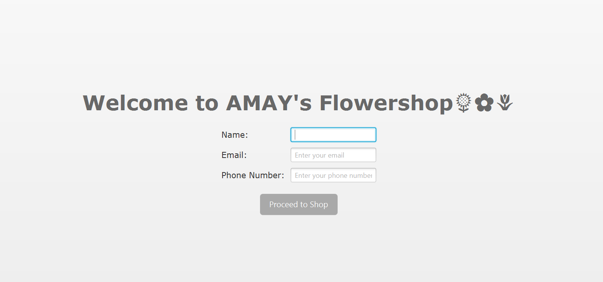
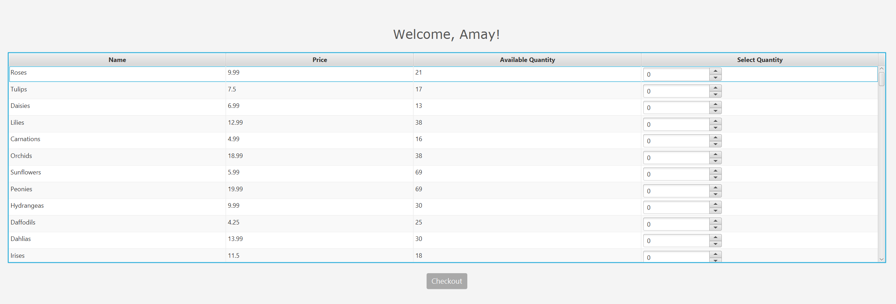
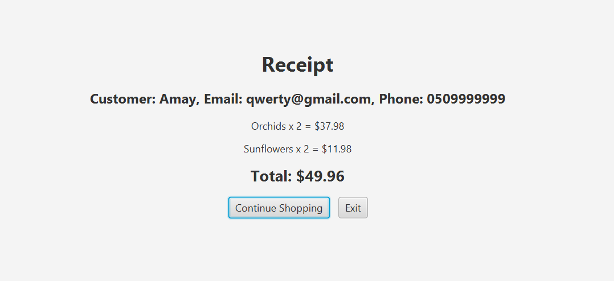
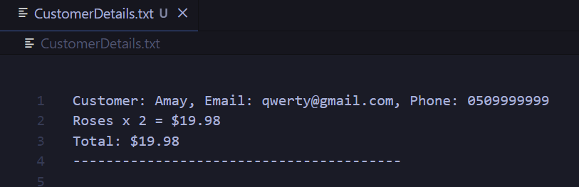
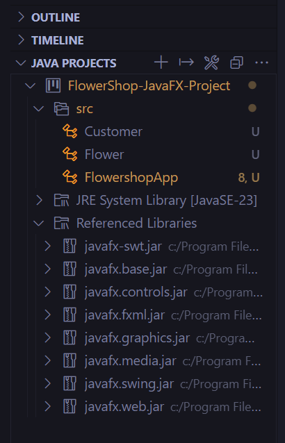
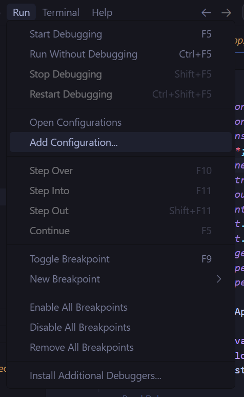
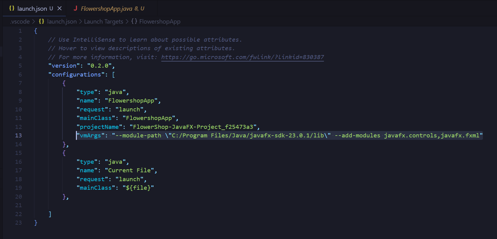

# FlowerShop JavaFX Application 🌻🌷🌼

Welcome to my **FlowerShop JavaFX Application** repository! This project was designed to enhance my Java programming and JavaFX skills. By developing this application, I explored core concepts such as data binding, event handling, file I/O, and input validations while focusing on creating an intuitive GUI.

---

## 📋 Table of Contents
- [📖 Overview](#-overview)
- [✨ Features](#-features)
- [🖼 Screenshots](#-screenshots)
- [🛠 Technologies Used](#-technologies-used)
- [⚙️ How It Works](#️-how-it-works)
- [🚀 Setup Instructions](#-setup-instructions)
- [🚧 Future Improvements](#-future-improvements)

---

## 📖 Overview
This application simulates a FlowerShop platform. Users can:
1. Enter their personal details (Name, Email, Phone).
2. Browse through a variety of flowers available for purchase.
3. Select desired quantities and generate a receipt.
4. Manage flower inventory dynamically.

This project served as a practical exercise to learn JavaFX and implement real-world application scenarios.

---

## ✨ Features
- **Opening Screen**: Collect user details with validations.
- **Flower Selection**: Display available flowers in a table with pricing and inventory information.
- **Checkout**: Generate a detailed receipt for purchases.
- **Inventory Management**: Dynamically update stock based on purchases.
- **File I/O**: Store flower and transaction data persistently.

---

## 🖼 Screenshots

### 🌟 Opening Screen


---

### 🌼 Flower Selection Screen


---

### 🧾 Checkout Screen


---

### 📂 Customer Details File


---

## 🛠 Technologies Used
- **Java**: Backend programming.
- **JavaFX**: For the user interface.
- **File I/O**: To persist flower inventory and transaction data.

---

## ⚙️ How It Works
1. **Opening Screen**:
   - Users enter their details: Name, Email, and Phone Number.
   - Validations ensure:
     - Name contains only alphabets.
     - Email is in the correct format.
     - Phone number is numeric and at least 10 digits.

2. **Flower Selection**:
   - Users browse through a table of flowers with their prices and available quantities.
   - A spinner allows users to select desired quantities.

3. **Checkout**:
   - A detailed receipt is displayed, including customer details, selected flowers, total cost, and updated inventory.
   - Customer transactions are saved to `CustomerDetails.txt`.

4. **Dynamic Inventory Management**:
   - Inventory in `Flowers.txt` is updated after every purchase.

---

## 🚀 Setup Instructions

Follow these steps to set up and run the project:

1. **Clone the repository**:
   ```bash
   git clone https://github.com/Amay-W/FlowerShop-JavaFX-Project.git
2. **Add JavaFX Dependencies**:
   - Add the JavaFX dependencies in your IDE (e.g., VS Code).
     
     

3. **Add Launch Configuration**:
   - Navigate to the **Run** tab and select **Add Configuration**:
     
     
   - Add the following `launch.json` entry (replace the `C:/Program Files/Java/javafx-sdk-23.0.1/lib` with your JavaFX SDK path):
     ```json
     "vmArgs": "--module-path \"C:/Program Files/Java/javafx-sdk-23.0.1/lib\" --add-modules javafx.controls,javafx.fxml"
     ```
   - Example of `launch.json`:
     

4. **Run the Application**:
   - Open the project in your IDE.
   - Run the `FlowershopApp.java` file.

---

## 🚧 Future Improvements
- **Email Integration**: Automatically send receipts to users via email.
- **Database Integration**: Replace text files with a relational database for better scalability.
- **Enhanced UI**: Improve design and responsiveness.

---


   
